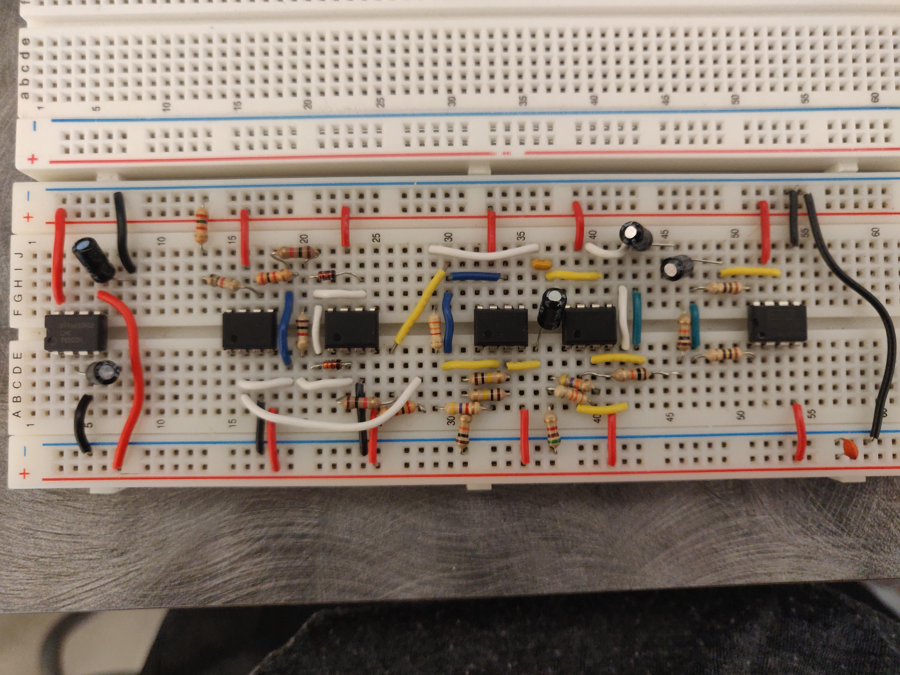
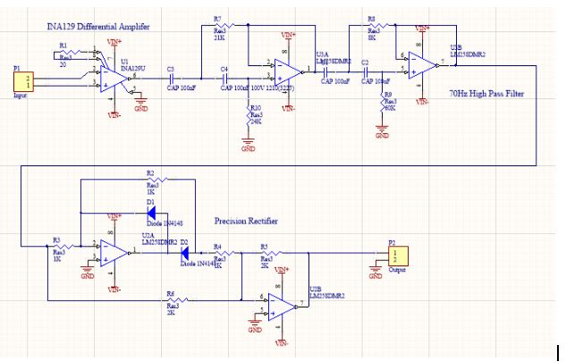
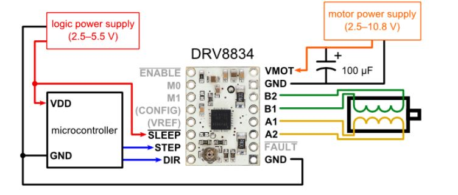

# grasp-nucleo

This project contains all the microcontroller code necessary for the GRASP.

Download visual studio code and the platformio extension in vs code to compile and upload to the Nucleo

# connections
- A3 to output of emg signal
- D5 to input signal of linear actuator drivers
- Ground nucleo and bread board

# debug
Noise issues; make sure electrodes are nice and sticky, change position to a large muscle area 
- change REF_VOLTAGAE in emg.h to higher or lower voltage
- ground to chassis ground
- move away from electronics

# to use the EMG
rest your arm on the table and flex either biceps or squeeze your hand into a fist

electrodes can be moved around to find the best spot

**use Putty to read the serial output!**
- Download Putty from online
- in Putty connect to Nucelo by choosing connection type 'serial'
    - speed (baud rate) 9600
    - serial line: COM# 
        - Find the COM channel through "device manager" on your laptop and going to "ports"

EMG out to A3

Input to actuator drivers (green wire going to drivers) to D5. Driver actuators are powered by 12V

Driver connections

- Sleep to 5V on Nucleo
- STEP to D9
- DIR to D8
- M0 to D10
- M1 to D11
- B2 to Yellow on stepper motor
- B1 to Red on stepper motor
- A1 to Orange on stepper Motor
- A2 to Blue on stepper motor

# to do
Add a voltage regulator for emg signal input
    - **don't plug in battery until electrodes are in position** and unplug battery before taking off electrodes